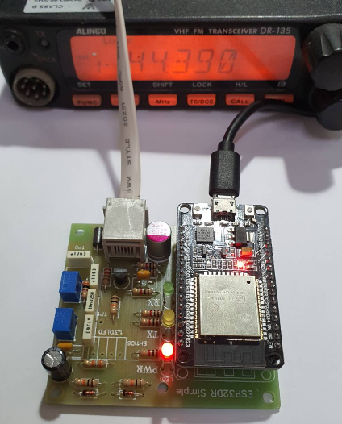
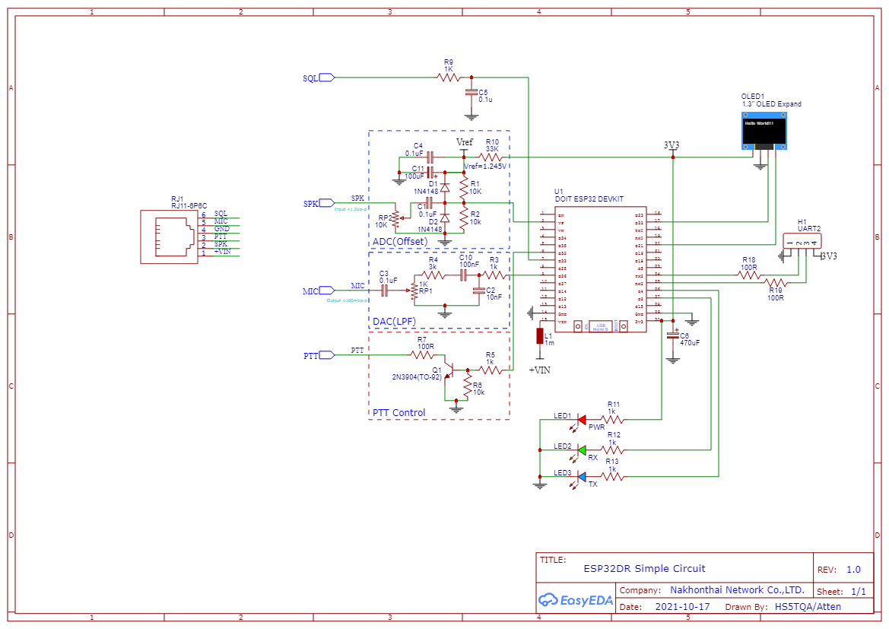
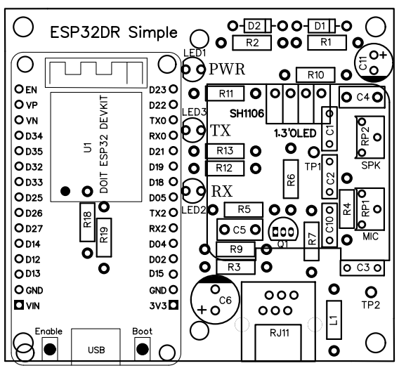
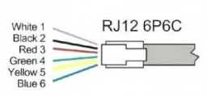
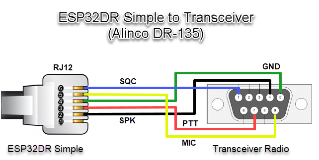
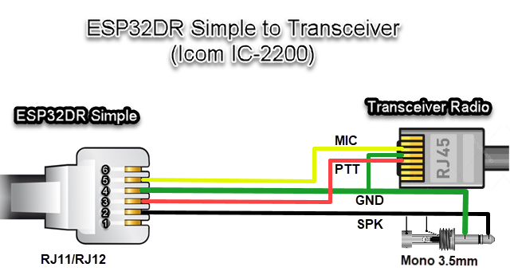
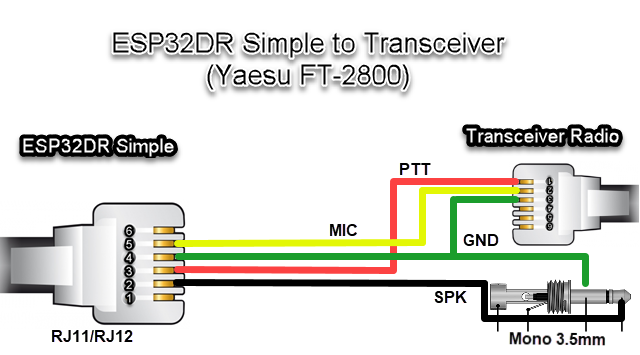
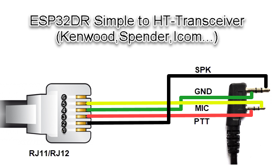
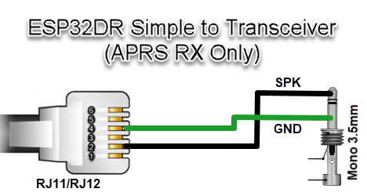
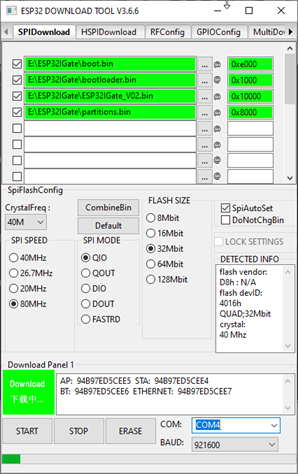

# ESP32IGate Simple Project

ESP32IGate is a Internet Gateway + TNC Built in that is implemented for Espressif ESP32 processor.
The development of ESP32IGate is for the study of converting analog signals to digital data. using the LibAPRS library to further develop
To receive signals via ADC SAR using interrupt sampling or using I2S to read sampling signals at 9600 sample/sec on ESP32 microcontrollers and improve data conductivity. Access to the Internet Gateway (APRS-IS) for further applications or developments. 

## Feature

* supported hardware: ESP32DR Simple or ESP32DR_SA818 by Module ESP32 DevKit
* using ESP-Arduino development on Visual studio code IDE
* support Bell202 1200bps AFSK
* implementing software modem, decoding and encoding
  * about >800 packets can be decoded against WA8LMF TNC TEST CD Track 1 (MP3)
* support TNC2 Raw protocol only
* using USB serial for host connection and power supply
* support Wi-Fi connection (TCP and UDP) to APRS-IS
* support Web Service config and control system
* display received and transmit packet on the LED

## ESP32DR Simple

ESP32DR Simple Circut is small interface board for connecting to a transceiver.

* PCB size is 64x58mm
* PCB Single size
* RJ11 6 Pin out to Radio

### Schematic

### CAD data
 
The gerber data is [here](doc/Gerber_ESP32DR_Simple.zip)

The PCB film positive is [here](doc/PCB_Bottom.pdf)

The PCB film negative is [here](doc/PCB_Bottom_Invert.pdf)

The PCB Layout is [here](doc/PCB_Layout.pdf)

The Schematic PDF is [here](doc/ESP32DR_Simple_Schematic.pdf)

### BOM list  

|Reference|Value|Description|
|---|:---:|---|
|U1|ESP32 DEVKIT|DOIT ESP32 DEVKIT (โมดูล ESP32)|
|RP2|1K|VR 3362W (R ปรับค่าเสียงออก)|
|RP1|10K|VR 3362W (R ปรับค่าเสียงเข้า)|
|RJ11|RJ11-6P6C|แจ๊คโมดูล RJ11 แบบ 6ขา|
|R13,R12,R11,R5,R3,R9|1K|R 1K 1/4W (ค่าสี: น้ำตาล ดำ แดง)|
|R7,R18,R19|100R|R 100R  1/4W (ค่าสี: น้ำตาล ดำ ดำ)|
|R6,R2,R1|10K|R 10k  1/4W  (ค่าสี: น้ำตาล ดำ ส้ม)|
|R4|3K|R 3k 1/4W (ค่าสี: ส้ม ดำ แดง)|
|R10|33K|R 33K 1/4W (ค่าสี: ส้ม ส้ม ส้ม)|
|Q1|2N3904|ทรานซิสเตอร์ NPN (TO-92)|
|LED3|LED 3.5mm|สีเหลือง แสดงส่งสัญญาณ TX|
|LED2|LED 3.5mm|สีเขียว แสดงรับสัญญาณ RX|
|LED1|LED 3.5mm|สีแดง แสดงไฟเข้าทำงาน|
|L1|L or JMP|L Isolate or Jumper|
|C11|100uF/6.3V|ตัวเก็บประจุแบบอิเล็กโทรไลติก|
|C4,C5|100nF|ตัวเก็บประจุแบบเซรามิกมัลติเลเยอร์|
|C6|470uF/10V|ตัวเก็บประจุแบบอิเล็กโทรไลติก|
|C1,C3,C10|100nF หรือ 0.1uF|ตัวเก็บประจุแบบโพลีโพรไพลีน|
|C2|10nF หรือ 0.01uF|ตัวเก็บประจุแบบโพลีโพรไพลีน|
|D2,D1|1N4148|ไดโอด หรือใช้ C 0.01uF แทนได้|

*R18 and R19 ไม่ใส่ก็ได้.  
*D2,D1 เปลี่ยนเป็นตัวเก็บประจุแบบเซรามิกมัลติเลเยอร์ค่า 10nF แทนได้ 
*หากใช้ต่อกับวิทยุรับส่งเข้าขาไมค์นอก ให้เปลี่ยน R4 เป็น 100K

จัดซื้อชุดคิทผ่าน Shopee ได้ที่ [คลิ๊ก](https://shopee.co.th/product/45191268/13373396785)

The Howto DIY is [here](doc/ESP32DR_DIY-Thai.pdf)

### Mounting drawing

### Transceiver connection

Solder jumper is needed depending on a transceiver.

|Manufacture|RJ11-1 (+VIN)|RJ11-2 (SPK)|RJ11-3 (PTT)|RJ11-4 (GND)|RJ11-5 (MIC)|RJ11-6 (SQL)|
|---|---|---|---|---|---|---|
|Alinco DR-135(DB9)|-|2|7|5|9|1|
|IC2200(RJ45)|-|SP|4|5|6|-|
|FT-2800(RJ11)|-|SP|1|3|2|-|
|HT Mic Cable|-|SPK|PTT|GND|MIC|-|

for Alinco DR-135(DB9)

for ICOM IC2200(RJ45)

for Yaesu FT-2800(RJ11)

for Handheld

## Howto Devellop
-Pull and Compile by PlatformIO on the Visual Studio Code.

## ESP32IGate firmware installation (do it first, next, update via web)
- 1.Connect the USB cable to the ESP32 Module.
- 2.Download firmware and open the program ESP32 DOWNLOAD TOOL, set it in the firmware upload program, set the firmware to ESP32IGate_Vxx.bin, location 0x10000 and partitions.bin at 0x8000 and bootloader.bin at 0x1000 and boot.bin at 0xe000, if not loaded, connect GPIO0 cable to GND, press START button finished, press power button or reset (red) again.
- 3.Then go to WiFi AP SSID: ESP32IGate and open a browser to the website. http://192.168.4.1 password: aprsthnetwork Can be fixed Or turn on your Wi-Fi router.
- 4.Push BOOT button long >100ms to TX Position and >10Sec to Factory Default

## ESP32 Flash Download Tools
https://www.espressif.com/en/support/download/other-tools

## HITH
This project implement by APRS text (TNC2 Raw) only,It not support null string(0x00) in the package.
